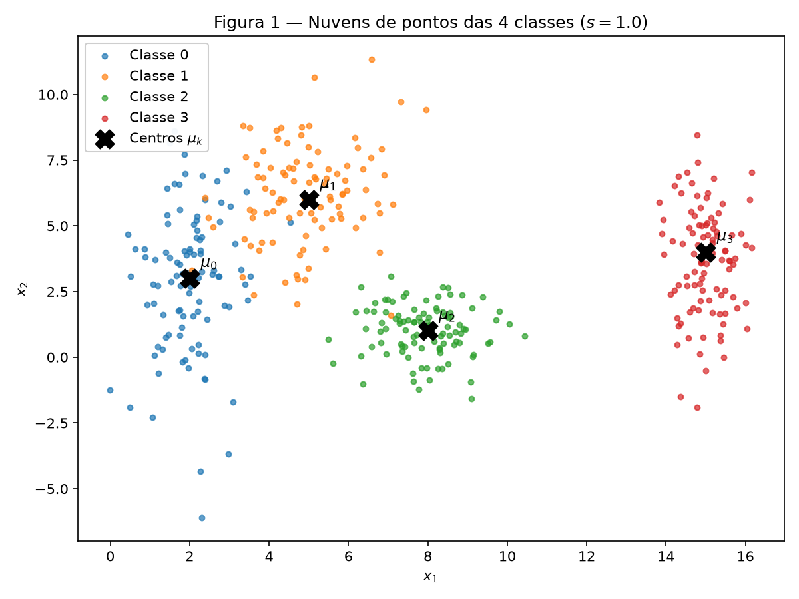
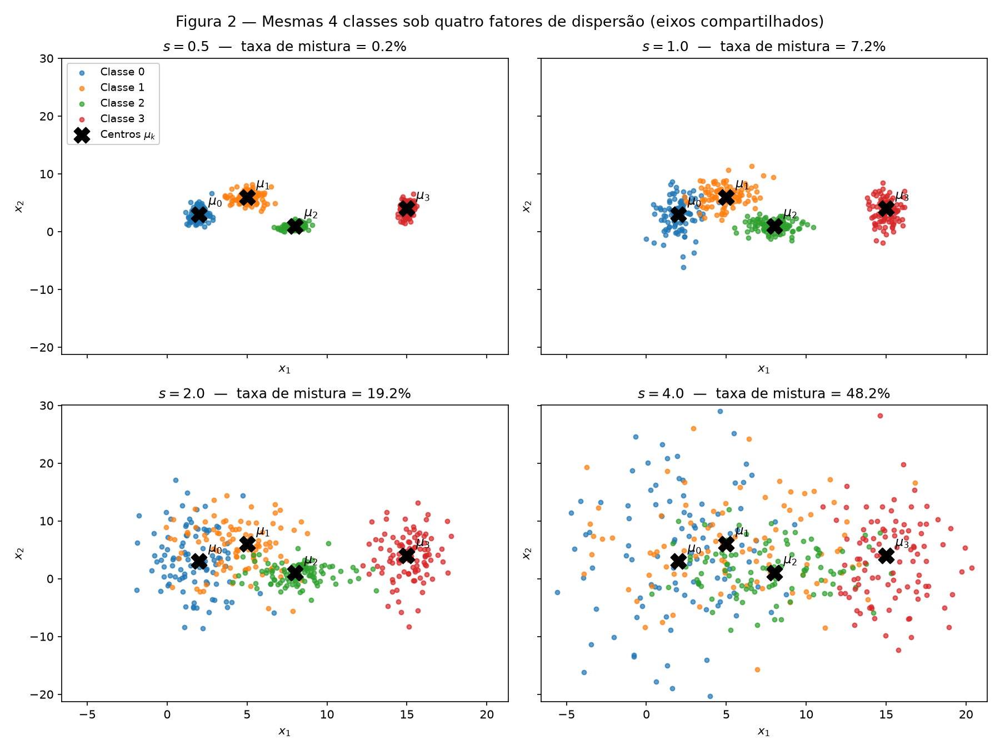
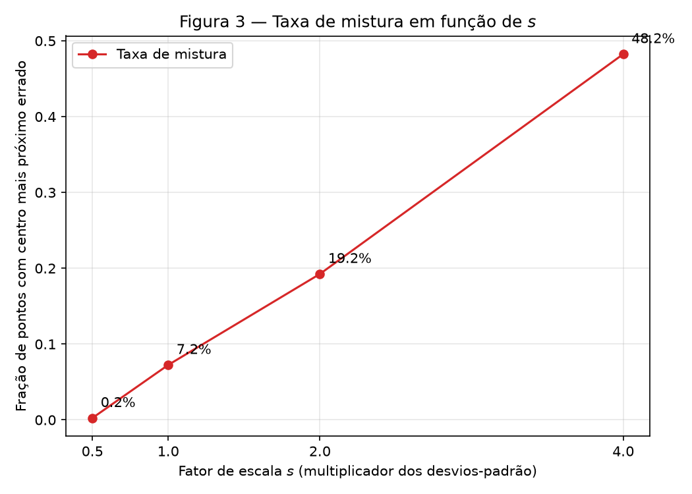
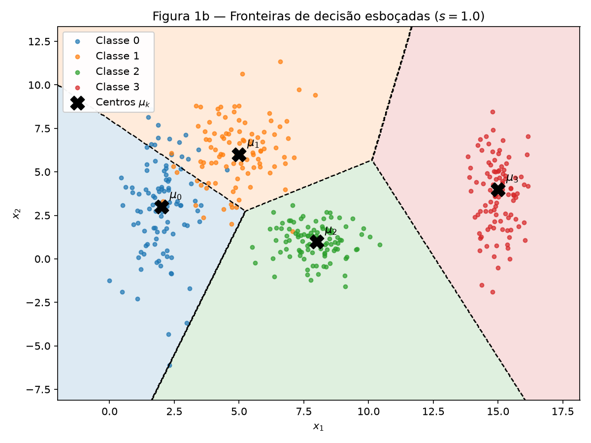
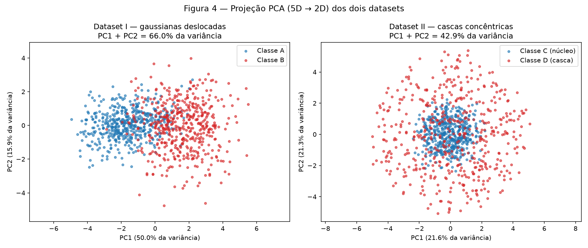
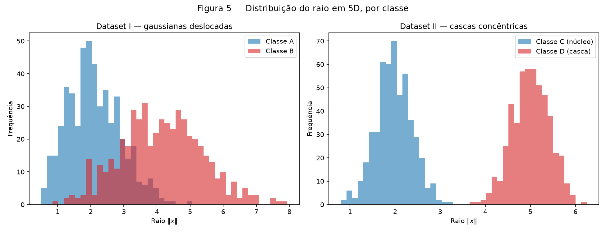
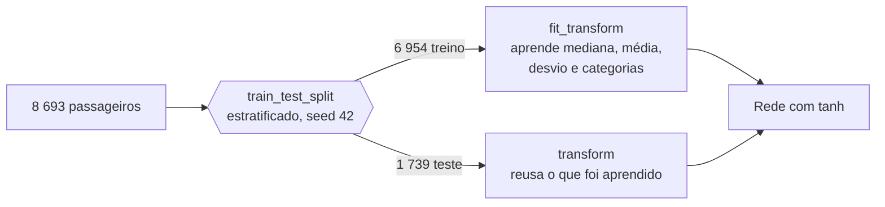
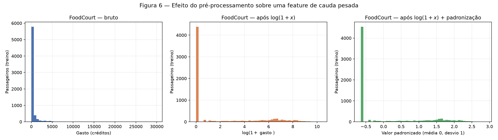

# 1. Data

!!! abstract "Enunciado"

    [Exercises → Data](https://insper.github.io/ann-dl/2026.2/exercises/data/){:target='_blank'} · prazo **10.set.2026**

    O fio condutor da atividade é a **dispersão dos dados**: o quanto uma nuvem de pontos se
    espalha, em qual direção, e como isso muda a dificuldade do problema de classificação.

!!! note "Reprodutibilidade"

    Semente única em todo o relatório: `rng = np.random.default_rng(42)` nos Exercícios 1 e 2,
    e `random_state=42` no `train_test_split` do Exercício 3. Cada script gera as suas figuras
    e imprime os números citados no texto. A partir da raiz do repositório:

    ```shell
    python docs/exercises/data/code/exercise1_point_clouds.py
    python docs/exercises/data/code/exercise2_high_dim.py
    python docs/exercises/data/code/exercise3_spaceship.py
    ```

## Exercise 1

**Point Clouds: Geometry and Spread in 2D**

### Abordagem

Gerei as 4 classes gaussianas do enunciado (100 pontos cada, 400 no total) quatro vezes, uma
para cada fator de escala $s \in \{0.5, 1.0, 2.0, 4.0\}$, multiplicando **apenas** os
desvios-padrão — as médias nunca mudam. Os quatro conjuntos são gerados de uma vez só, em
ordem fixa, e reusados em todas as figuras e métricas, de modo que a amostra de $s = 1$ que
aparece na Figura 1 é exatamente a mesma que alimenta a Figura 2 e as contas. A separabilidade
é medida por dois indicadores independentes: o *separation ratio* $r_{ij}$, que é analítico
(sai só dos parâmetros), e a **taxa de mistura**, que é empírica (sai da amostra).

``` { .python .copy .select linenums='1' title="docs/exercises/data/code/exercise1_point_clouds.py" }
--8<-- "docs/exercises/data/code/exercise1_point_clouds.py"
```

1.  Semente fixa: sem ela, os números da tabela de resultados mudam a cada execução e a
    correção não consegue reproduzir o relatório.
2.  `plt.close(fig)` evita o vazamento de figuras quando o script gera várias em sequência.

### A — Gerar as nuvens

| Classe | Média $\mu_k$ | Desvio-padrão $\sigma_k$ | $\bar{\sigma}_k = \frac{\sigma_{k,x} + \sigma_{k,y}}{2}$ |
|---|---|---|---:|
| 0 | $[2,\ 3]$ | $[0.8,\ 2.5]$ | 1.65 |
| 1 | $[5,\ 6]$ | $[1.2,\ 1.9]$ | 1.55 |
| 2 | $[8,\ 1]$ | $[0.9,\ 0.9]$ | 0.90 |
| 3 | $[15,\ 4]$ | $[0.5,\ 2.0]$ | 1.25 |


/// caption
**Figura 1** — As 4 classes no plano $(x_1, x_2)$ com $s = 1.0$, com o centro $\mu_k$ de cada
nuvem marcado com **✕**.
///

Já na Figura 1 dá para ler a geometria do problema. A classe 3 está isolada à direita
($\mu_{3,x} = 15$, a mais de 7 unidades da vizinha mais próxima) e é a única visualmente
intocada. As classes 0 e 1 se tocam: os centros estão a $\lVert[3, 3]\rVert = 4.24$ de
distância, mas a classe 0 tem $\sigma_y = 2.5$ — a maior dispersão vertical do conjunto — e se
estica justamente na direção da classe 1. A classe 2 é a mais compacta ($\sigma = [0.9, 0.9]$)
e fica embaixo, encostando na cauda inferior da classe 1.

### B — Mais ou menos espalhadas


/// caption
**Figura 2** — As mesmas 4 classes sob os quatro fatores de escala. Os quatro painéis
compartilham os mesmos limites de eixo: sem isso o matplotlib reescalaria cada painel e as
nuvens pareceriam idênticas.
///

#### Separation ratio $r_{ij}$ em $s = 1$

$$
r_{ij} = \frac{\lVert \mu_i - \mu_j \rVert}{\bar{\sigma}_i + \bar{\sigma}_j},
\qquad \bar{\sigma}_k = \frac{\sigma_{k,x} + \sigma_{k,y}}{2}
$$

| Par $(i, j)$ | $\lVert \mu_i - \mu_j \rVert$ | $\bar{\sigma}_i + \bar{\sigma}_j$ | $r_{ij}$ |
|---|---:|---:|---:|
| (0, 1) | 4.243 | 3.20 | **1.326** |
| (0, 2) | 6.325 | 2.55 | 2.480 |
| (0, 3) | 13.038 | 2.90 | 4.496 |
| (1, 2) | 5.831 | 2.45 | 2.380 |
| (1, 3) | 10.198 | 2.80 | 3.642 |
| (2, 3) | 7.616 | 2.15 | 3.542 |

O menor valor é $r_{01} = 1.326$ — o par (0, 1), exatamente o que a Figura 1 sugere. O maior é
$r_{03} = 4.496$, o par mais distante.

Como as médias não mudam com $s$ e o denominador inteiro é multiplicado por $s$, vale
$r_{ij}(s) = r_{ij}(1) / s$. Logo, **sem gerar nada novo**, em $s = 2$ a menor razão vira

$$
r_{01}(2) = \frac{1.326}{2} = \mathbf{0.663}.
$$

#### Taxa de mistura

A taxa de mistura é a fração de pontos cujo centro de classe mais próximo não é o da própria
classe. É puramente geométrica — compara cada ponto com as 4 médias teóricas, sem treinar nada.

| $s$ | Taxa de mistura | Pontos mal posicionados (de 400) |
|---:|---:|---:|
| 0.5 | **0.25 %** | 1 |
| 1.0 | **7.25 %** | 29 |
| 2.0 | **19.25 %** | 77 |
| 4.0 | **48.25 %** | 193 |


/// caption
**Figura 3** — Taxa de mistura × fator de escala $s$. Em $s = 4$ o valor de 48.25 % já percorreu
dois terços do caminho até os 75 % de erro de um palpite uniforme entre 4 classes: a informação
da posição quase desapareceu.
///

#### A partir de qual escala as nuvens deixam de ser separáveis por retas?

**A partir de $s = 2$.** O critério é $r_{ij} < 1$: quando a distância entre os centros fica
menor que a soma das dispersões médias, as duas nuvens ocupam fisicamente a mesma região, e
nenhuma reta pode dividi-las sem cortar as duas. O par (0, 1) cruza esse limiar exatamente em
$s = 2$, onde $r_{01} = 0.663 < 1$ — e a taxa de mistura salta de 7.25 % para 19.25 %.

Vale ser preciso: a separação perfeita já não existia em $s = 1$, porque 7.25 % dos pontos já
caem mais perto do centro errado. O que muda em $s = 2$ é a natureza do erro. Até $s = 1$ o
que se perde são as caudas das distribuições, e um conjunto de retas ainda captura o corpo de
cada classe; de $s = 2$ em diante os corpos se sobrepõem, e o erro deixa de ser uma franja
para virar uma região. Em $s = 4$, com $r_{01} = 0.332$, só a classe 3 ainda se destaca.

### C — Análise

**Descreva a sobreposição das quatro classes em $s = 1$.**
Há três regimes distintos na Figura 1. A classe 3 está separada de todas por larga margem
($r_{3j} \geq 3.54$). As classes 1 e 2 são vizinhas mas distinguíveis
($r_{12} = 2.38$) — o contato é pela cauda inferior da 1 contra o topo da 2. E as classes 0 e
1 se interpenetram de verdade ($r_{01} = 1.33$): a dispersão vertical grande da classe 0
($\sigma_y = 2.5$) joga parte dos seus pontos para dentro do território da classe 1. Dos 29
pontos mal posicionados em $s = 1$, a grande maioria está nesse par.

**Uma única fronteira linear separa todas as classes?**
Não. Uma única fronteira linear é um hiperplano, que divide o plano em **duas** regiões — são
4 classes, então já por contagem o problema é impossível, independentemente da geometria.

**E um conjunto de fronteiras lineares?**
Sim, quase todo o caminho. Três retas bem posicionadas recuperam a estrutura: uma vertical em
$x_1 \approx 11$ isola a classe 3, e mais duas separam 0, 1 e 2 entre si. É exatamente a
partição de Voronoi das quatro médias, esboçada na Figura 1b. O resíduo é o par (0, 1): a reta
entre eles corta a sobreposição e erra os 7.25 % de pontos que já estavam do lado errado. Isso
é um piso de erro, não uma falha do modelo — nenhuma fronteira, linear ou não, zera esse erro,
porque os pontos de classes diferentes ocupam as mesmas coordenadas.


/// caption
**Figura 1b** — Fronteiras de decisão esboçadas sobre a Figura 1. As regiões são a partição de
Voronoi das 4 médias — calculada, e não desenhada à mão, para não inventar fronteira. É o que
uma rede treinada aprenderia se os custos fossem simétricos e as dispersões parecidas.
///

**Quanto mais espalhadas as nuvens, o que acontece com a região onde a rede erra
necessariamente?**
Ela cresce, e cresce mais rápido que a dispersão. Dobrar $s$ de 1 para 2 quase triplicou a taxa
de mistura (7.25 % → 19.25 %); dobrar de novo levou a 48.25 %. O motivo é que as fronteiras
ficam **paradas** — elas dependem só das médias, que não mudam — enquanto as nuvens se
esticam por cima delas. A rede não pode fazer nada a respeito: a região de erro é uma
propriedade dos dados, não da arquitetura. Uma rede maior ajustaria a fronteira com mais
precisão, mas o piso de 19.25 % em $s = 2$ continua lá. Espalhar os dados não torna o problema
mais difícil de *aprender* — torna-o mais difícil de *resolver*.

## Exercise 2

**Non-Linearity in Higher Dimensions**

### Abordagem

Construí os dois conjuntos 5D do enunciado com a mesma semente: o Dataset I são duas normais
multivariadas deslocadas, com covariâncias diferentes; o Dataset II são duas cascas esféricas
concêntricas. O contraste entre eles é o ponto do exercício — os dois têm a mesma
dimensionalidade e o mesmo número de amostras, mas só um é linearmente separável. Reduzi ambos
a 2D com PCA para visualizar e, em paralelo, calculei em **5D** duas medidas que não dependem
da projeção: a distância entre os centros e o histograma do raio $\lVert x \rVert$.

``` { .python .copy .select linenums='1' title="docs/exercises/data/code/exercise2_high_dim.py" }
--8<-- "docs/exercises/data/code/exercise2_high_dim.py"
```

### A — Dataset I: gaussianas deslocadas

500 amostras por classe, $\mu_A = [0,0,0,0,0]$ e $\mu_B = [1.5]\times 5$, com as matrizes de
covariância do enunciado. As duas classes têm dispersões diferentes de propósito:
$\Sigma_B$ tem variâncias maiores (1.5 contra 1.0) e correlação **negativa** entre as duas
primeiras features ($-0.7$), enquanto $\Sigma_A$ tem correlação positiva ($+0.8$) nas mesmas.
Resultado: as duas nuvens não são apenas deslocadas, são também orientadas em direções
diferentes.

### B — Dataset II: cascas concêntricas

500 amostras por classe, também em 5D, mas com estrutura radial: direção $u$ uniforme na
esfera unitária de $\mathbb{R}^5$, raio $\rho$ gaussiano, e $x = \rho \cdot u$.

!!! info "Por que $v \sim \mathcal{N}(0, I_5)$ e depois normalizar"

    A normal isotrópica não privilegia direção nenhuma, então $u = v / \lVert v \rVert$ cai
    uniformemente sobre a esfera. O atalho intuitivo — sortear cada coordenada em $[-1, 1]$ e
    normalizar — concentraria os pontos nas diagonais do hipercubo, porque os cantos estão
    mais longe do centro que as faces. Em 5 dimensões essa distorção é grande.

!!! warning "Leitura de $\mathcal{N}(2.0,\ 0.4)$"

    Li o segundo parâmetro como **desvio-padrão**, não variância. Os raios médios medidos
    confirmam a leitura: 1.972 para a classe C e 5.005 para a D, contra os 2.0 e 5.0
    nominais, com as cascas finas e bem separadas (Figura 5).

### C — Visualizar e comparar


/// caption
**Figura 4** — Projeção PCA (5D → 2D) dos dois conjuntos. À esquerda, o Dataset I: duas nuvens
deslocadas ao longo de PC1. À direita, o Dataset II: a classe C (núcleo) no centro, a classe D
(casca) formando um anel ao redor.
///

| Medida | Dataset I | Dataset II |
|---|---:|---:|
| Distância entre os centros (5D) | **3.228** | **0.266** |
| Valor teórico da distância | $1.5\sqrt{5} = 3.354$ | $0$ |
| Variância explicada — PC1 | 50.04 % | 21.59 % |
| Variância explicada — PC2 | 15.93 % | 21.32 % |
| **PC1 + PC2** | **65.97 %** | **42.91 %** |
| Raio médio — classe 1 | 2.109 (A) | 1.972 (C) |
| Raio médio — classe 2 | 4.128 (B) | 5.005 (D) |

**Em qual conjunto a projeção 2D preserva melhor a informação relevante?**
No Dataset I, e por uma razão estrutural. Lá existe uma direção privilegiada — a do
deslocamento $\mu_B - \mu_A$ — e a PCA a encontra: PC1 sozinha carrega 50.04 % da variância e
é justamente o eixo ao longo do qual as classes se separam na Figura 4. No Dataset II não
existe direção privilegiada: os dados são isotrópicos, e as cinco componentes dividem a
variância quase igualmente. Os 42.91 % de PC1 + PC2 estão bem próximos dos 40 % que seriam a
divisão perfeitamente uniforme de 2 componentes entre 5 — o que confirma a isotropia em vez de
indicar uma projeção ruim.


/// caption
**Figura 5** — Distribuição do raio $\lVert x \rVert$ em 5D, com as duas classes sobrepostas.
No Dataset II (direita) os dois histogramas praticamente não se tocam, apesar de os centros
coincidirem.
///

### D — Análise

**No Dataset II a distância entre os centros é quase zero, mas os histogramas de raio são bem
separados. O que essa combinação diz sobre separar as classes com um hiperplano?**

Diz que **nenhum hiperplano funciona** — e o argumento é mais forte do que "está difícil".
Um classificador linear decide por $f(x) = w^\top x + b$. No Dataset II, escrevendo
$x = \rho u$, temos $w^\top x = \rho \,(w^\top u)$. Como $u$ é uniforme na esfera, $w^\top u$ é
simétrico em torno de zero para **qualquer** $w$ — e $\rho > 0$ nas duas classes. Logo, a
projeção de cada classe sobre qualquer direção $w$ é uma distribuição simétrica centrada em
zero. As duas se sobrepõem quase completamente, e o melhor limiar possível acerta perto de
50 %: o mesmo que jogar uma moeda. A classe D, por ter raio maior, tem projeção mais espalhada
— mas *mais espalhado dos dois lados* não é informação que um limiar consiga usar.

Ao mesmo tempo, o histograma de raio mostra que a informação **existe** e é quase perfeita:
raio médio 1.972 contra 5.005, com sobreposição desprezível. Ou seja, a informação está toda
em uma quantidade que nenhuma combinação linear das features consegue expressar.

**Por que nenhuma quantidade de dados resolve isso?**

Porque não é um problema estatístico, é geométrico. Mais amostras estimam melhor os parâmetros
do modelo, mas não mudam o conjunto de funções que o modelo consegue representar. Um hiperplano
divide $\mathbb{R}^5$ em dois semiespaços; a classe C é uma bola em torno da origem, e a classe
D a envolve por completo em todas as direções. Qualquer semiespaço que contenha a bola contém
também metade da casca. Com $10^9$ amostras a fronteira ótima continua sendo a mesma, e o erro
continua em ~50 %. É exatamente isso que uma camada oculta com ativação não linear resolve: ela
constrói features novas — combinações não lineares das originais — e é nesse espaço
transformado que uma fronteira linear passa a existir.

**A PCA é linear. Uma projeção 2D em que as classes parecem misturadas prova que elas são
inseparáveis no espaço original?**

Não prova nada, e o Dataset II é a demonstração dos dois lados da questão. Pelos números, a
projeção é ruim: 42.91 % da variância, contra 65.97 % do Dataset I — e a distância entre os
centros, 0.266, é praticamente zero, que é o indicador que um classificador linear usaria. Se
eu olhasse só para esses números, concluiria que o Dataset II é o caso perdido. E ainda assim
ele é o **mais** separável dos dois: $100\,\%$ de acurácia contra a sobreposição real do
Dataset I.

O que a projeção pode ou não revelar depende de sorte estrutural. Aqui deu certo: como a
estrutura é radial e a PCA preserva distâncias à origem dentro do subespaço projetado, o anel
sobrevive à projeção e fica visível na Figura 4. Mas uma estrutura em que as classes se
alternassem ao longo de uma direção descartada teria sumido por completo. A conclusão que se
pode tirar de uma projeção é assimétrica: **classes separadas na projeção são separáveis no
original** (a projeção é linear, então a fronteira volta); classes misturadas na projeção não
dizem nada.

**Uma função simples das entradas que separa o Dataset II**

$$
g(x) = \lVert x \rVert^2 - t^2 = \sum_{i=1}^{5} x_i^2 - 12.25,
\qquad t = 3.5
$$

Classifique como D se $g(x) > 0$, como C caso contrário. O limiar $t = 3.5$ é o ponto médio
entre os raios médios das duas cascas (1.972 e 5.005). Acurácia medida: **100.00 %** nas 1000
amostras.

Vale notar o que $g$ é: um polinômio de grau 2 sem termos cruzados. Ela mostra que o Dataset II
não é "difícil" — é apenas *linearmente* difícil. No espaço aumentado
$(x_1, \dots, x_5, x_1^2, \dots, x_5^2)$, um hiperplano resolve o problema perfeitamente. Uma
MLP com uma camada oculta e ativação não linear aprende algo funcionalmente equivalente a isso
sem que ninguém precise lhe dizer qual é a feature certa.

## Exercise 3

**Preparing Real-World Data for a Neural Network**

### Abordagem

Preparei o Spaceship Titanic para uma rede com ativação `tanh`. A ordem das operações é o
ponto central: **descrever → separar → transformar**, nessa sequência e nunca em outra. Todo o
pré-processamento vive em um único `ColumnTransformer`, cujo `fit` enxerga apenas o conjunto de
treino; o teste passa só por `transform`. Toda estatística usada nas transformações — mediana,
média, desvio-padrão, categorias observadas — é aprendida nos 6 954 passageiros de treino.

!!! info "Onde vive o `train.csv`"

    O arquivo fica em `data/spaceship-titanic/train.csv`, na raiz do repositório e **fora** de
    `docs/` — assim ele é versionado (o relatório é reproduzível) sem ser copiado para dentro
    do site publicado. O script resolve o caminho a partir da própria localização e falha com
    mensagem explícita se o arquivo não estiver lá.

``` { .python .copy .select linenums='1' title="docs/exercises/data/code/exercise3_spaceship.py" }
--8<-- "docs/exercises/data/code/exercise3_spaceship.py"
```

### A — Conhecer os dados

O `train.csv` tem **8 693 linhas e 14 colunas**. O objetivo é prever `Transported`: se o
passageiro foi transportado para outra dimensão durante a colisão da Spaceship Titanic. É um
problema de classificação binária, e as classes são **quase perfeitamente balanceadas** —
**50.3624 %** de positivos (4 378 `True` contra 4 315 `False`). Isso simplifica bastante a vida:
não há necessidade de reponderar a *loss* nem de reamostrar, e a acurácia é uma métrica honesta.

#### Tipos de feature

| Tipo | Colunas |
|---|---|
| **Numéricas** | `Age`, `RoomService`, `FoodCourt`, `ShoppingMall`, `Spa`, `VRDeck` |
| **Categóricas** | `HomePlanet`, `CryoSleep`, `Destination`, `VIP` |
| **Alvo** | `Transported` (booleano) |
| **Descartadas** | `PassengerId`, `Name` (identificadores), `Cabin` (por instrução do enunciado) |

`CryoSleep` e `VIP` são booleanos, mas com valores ausentes — por isso entram como categóricos:
o `SimpleImputer` de moda seguido de one-hot trata o ausente sem precisar escolher entre
`True` e `False` na marra.

#### Valores ausentes

| Coluna | Ausentes | % do total |
|---|---:|---:|
| `CryoSleep` | 217 | 2.50 % |
| `ShoppingMall` | 208 | 2.39 % |
| `VIP` | 203 | 2.34 % |
| `HomePlanet` | 201 | 2.31 % |
| `Name` | 200 | 2.30 % |
| `Cabin` | 199 | 2.29 % |
| `VRDeck` | 188 | 2.16 % |
| `FoodCourt` | 183 | 2.11 % |
| `Spa` | 183 | 2.11 % |
| `Destination` | 182 | 2.09 % |
| `RoomService` | 181 | 2.08 % |
| `Age` | 179 | 2.06 % |

São **2 324 células ausentes** no total, espalhadas por 12 das 14 colunas. O padrão é
notavelmente uniforme — todas entre 2.06 % e 2.50 % —, o que sugere perda aleatória de
registros, e não uma causa sistemática ligada a algum tipo de passageiro. Nenhuma coluna
perdeu o suficiente para justificar descarte, e descartar as linhas incompletas custaria mais
de 20 % do dataset (2 087 das 8 693 linhas têm pelo menos um ausente). Imputar é claramente a
escolha certa aqui.

#### Colunas de gasto: média, mediana e máximo

| Coluna | Média | Mediana | Máximo | % de zeros |
|---|---:|---:|---:|---:|
| `RoomService` | 224.69 | 0.00 | 14 327 | 64.2 % |
| `FoodCourt` | 458.08 | 0.00 | 29 813 | 62.8 % |
| `ShoppingMall` | 173.73 | 0.00 | 23 492 | 64.3 % |
| `Spa` | 311.14 | 0.00 | 22 408 | 61.2 % |
| `VRDeck` | 304.85 | 0.00 | 24 133 | 63.2 % |

**O que a diferença entre média e mediana diz?** Aqui ela diz o máximo possível: a mediana é
**zero** nas cinco colunas, enquanto a média vai de 174 a 458. Isso significa que mais de
metade dos passageiros não gastou nada em cada amenidade — de fato, entre 61 % e 64 % são
zeros exatos. A média inteira é produzida por uma minoria: em `FoodCourt`, o máximo de 29 813
é **65 vezes** a média e infinitamente maior que a mediana.

Duas leituras práticas saem daí. Primeiro, a assimetria é extrema e positiva — a distribuição é
uma barra gigante no zero com uma cauda longuíssima à direita (painel esquerdo da Figura 6).
Segundo, imputar pela **média** seria um erro grave: ela substituiria o ausente por um valor
que mais de 60 % dos passageiros não têm. A mediana (zero) representa o passageiro típico.

Há também um sinal escondido aí: gastar zero em tudo é provavelmente o passageiro em
criogenia, que fica confinado à cabine. Foi o que motivou criar `TotalSpend`, no item C.

### B — Separar antes de transformar

Separei **80/20, estratificado pelo alvo, com semente fixa em 42**:

| Conjunto | Forma | Positivos |
|---|---|---:|
| Treino | (6 954, 11) | 50.3595 % |
| Teste | (1 739, 11) | 50.3738 % |

A estratificação funcionou: as duas proporções batem com os 50.3624 % do conjunto completo até
a terceira casa.

!!! warning "Por que o split vem antes da imputação e do escalonamento"

    Porque imputação e escalonamento **aprendem parâmetros a partir dos dados** — a mediana de
    `FoodCourt`, a média e o desvio de `Age`, as categorias vistas em `HomePlanet`. Se esses
    parâmetros forem calculados sobre o dataset inteiro, cada linha de teste terá contribuído
    para a sua própria transformação, e o conjunto de teste deixa de simular dados nunca
    vistos. O resultado é uma métrica otimista: o modelo parece melhor do que será em produção,
    e o erro aparece só depois, quando já é caro. Separar primeiro custa duas linhas de código
    e é a única forma de a avaliação significar alguma coisa.



### C — Pré-processar

#### Dados ausentes

| Tipo | Estratégia | Justificativa |
|---|---|---|
| Gastos + `Age` | `SimpleImputer(strategy="median")` | A mediana resiste a outliers; com 62 % de zeros e caudas até 29 813, a média seria puxada pela minoria que gasta muito. |
| Categóricas | `SimpleImputer(strategy="most_frequent")` | O ausente aqui não parece carregar significado próprio (a taxa é uniforme em todas as colunas), e cada coluna tem categoria dominante clara. |

Ambos os imputadores são ajustados **só no treino** — estão dentro do `ColumnTransformer`, que
recebe `fit_transform` no treino e `transform` no teste.

#### Features categóricas

`OneHotEncoder(handle_unknown="ignore")` sobre `HomePlanet`, `CryoSleep`, `Destination` e
`VIP`. As 4 colunas viraram **10 colunas binárias**.

**Como o código trata uma categoria que aparece só no teste?** O `handle_unknown="ignore"` faz
com que a categoria desconhecida seja codificada como uma **linha de zeros** em todas as
colunas daquela feature, em vez de levantar exceção. A alternativa padrão (`"error"`) quebraria
o `transform` no primeiro passageiro de um planeta não visto no treino — exatamente o tipo de
falha que só aparece em produção. Vale notar a consequência: a rede recebe um vetor que não
corresponde a nenhuma categoria conhecida e terá de se virar com o viés da camada. É aceitável
para categorias raras; se fossem frequentes, o caminho seria agrupá-las em uma categoria
`"Other"` explícita durante o treino.

#### Engenharia de features

`TotalSpend` = soma das cinco colunas de gasto. É uma operação **linha a linha**, sem nenhuma
estatística do conjunto, então não gera vazamento e pode ser calculada antes do split. A
motivação é a observação do item A: gasto total zero é quase um detector de criogenia, e dar
essa soma pronta poupa a rede de ter que aprender a somar cinco entradas.

A soma usa `min_count=1`: uma linha com os cinco gastos ausentes continua ausente e cai no
imputador, em vez de virar um zero inventado que a rede leria como "passageiro frugal".

#### Caudas pesadas: $\log(1+x)$

$$
x' = \log(1 + x)
$$

Aplicado às cinco colunas de gasto e a `TotalSpend`. O `1 +` existe porque o zero é o valor
mais comum da coluna e $\log(0)$ é indefinido; $\log(1+0) = 0$ mantém o zero no lugar.

**Por que isso ajuda uma rede com `tanh`?** A `tanh` satura: para $|z| \gtrsim 2$ ela já
devolve quase $\pm 1$, e a derivada vai a zero. Uma entrada de 29 813 contra uma mediana de 0
produz, depois de padronizar, um valor padronizado enorme — o neurônio satura, o gradiente
desaparece e aquele passageiro não ensina nada à rede. Pior: como a padronização usa o desvio
inflado pela cauda, os 62 % de passageiros que gastaram zero ficam todos espremidos em uma
faixa estreita, indistinguíveis entre si. O $\log(1+x)$ comprime a cauda e devolve resolução ao
corpo da distribuição. Na prática: `FoodCourt` bruto vai de 0 a 29 813; depois do
$\log(1+x)$, de 0 a 10.3; depois da padronização, de **−0.64 a 2.88** — dentro da faixa em que
a `tanh` ainda tem gradiente útil.

#### Escalonamento

Escolhi **padronização** (`StandardScaler`, média 0 e desvio 1) em vez de normalizar para
$[-1, 1]$. A razão é o que o min-max faria com estes dados: ele ancora a escala nos **extremos**
observados, e um único passageiro com gasto de 29 813 definiria o topo da faixa, empurrando
todos os outros para perto do mínimo. A padronização ancora no centro e na dispersão, que é
onde está a massa dos dados. Combinada com o $\log(1+x)$, que já removeu a assimetria, ela
entrega uma distribuição centrada em zero — que é justamente onde a `tanh` é aproximadamente
linear e tem gradiente máximo.

Faixa resultante:

| Conjunto | Mínimo | Máximo |
|---|---:|---:|
| Treino | **−1.9961** | **3.5080** |
| Teste | **−1.9961** | **3.3687** |

Que o máximo do teste (3.3687) seja menor que o do treino confirma que o `scaler` foi ajustado
só no treino: o extremo global do dataset caiu no lado de treino, e o teste foi transformado
com parâmetros que não o conhecem.

### D — Verificar e visualizar


/// caption
**Figura 6** — `FoodCourt` no conjunto de treino em três estágios. À esquerda, o dado bruto:
tudo empilhado no zero e uma cauda que se estende até 29 813. No centro, após $\log(1+x)$: a
cauda vira um corpo distribuído entre 5 e 9. À direita, após a padronização: a mesma forma,
agora centrada em zero e na faixa $[-0.64,\ 2.88]$.
///

A barra no zero sobrevive às três etapas, e isso é correto — ela é um fato sobre os dados
(63 % dos passageiros não gastaram nada), não um artefato de escala. O que mudou foi a
resolução do restante: no painel esquerdo, os 37 % que gastaram algo estão todos comprimidos
contra a margem esquerda; no direito, eles ocupam uma faixa larga em que a rede consegue
distinguir um passageiro que gastou 100 de um que gastou 5 000.

#### Verificações finais

| Verificação | Resultado |
|---|---|
| NaN restantes no treino | **0** |
| NaN restantes no teste | **0** |
| Forma final da matriz de treino | **(6 954, 17)** |
| Forma final da matriz de teste | **(1 739, 17)** |
| Composição das 17 colunas | 7 numéricas (5 gastos + `TotalSpend` + `Age`) + 10 binárias do one-hot |
| Média das colunas numéricas (treino) | $-4.4 \times 10^{-19}$ (zero numérico) |
| Desvio das colunas numéricas (treino) | 1.0000 |
| Faixa de valores — treino | $[-1.9961,\ 3.5080]$ |
| Faixa de valores — teste | $[-1.9961,\ 3.3687]$ |

A faixa é compatível com `tanh`: os valores estão concentrados em torno de zero, onde a
ativação tem gradiente máximo, e o extremo em 3.51 é um outlier isolado, não a escala típica.
As colunas binárias do one-hot ficam em $\{0, 1\}$, sem padronização — padronizá-las só
deslocaria zeros e uns para valores arbitrários sem ganho, e destruiria a esparsidade.

#### Qual decisão de pré-processamento mais afetaria o treinamento?

O $\log(1+x)$ nas colunas de gasto, com folga. As outras decisões são melhorias incrementais:
trocar a mediana pela média na imputação afetaria 2 % das linhas; descartar `TotalSpend`
custaria uma feature que a rede poderia reconstruir sozinha; trocar padronização por min-max
mudaria a escala, mas não a forma. Já pular o $\log(1+x)$ muda o regime de operação da rede.
Sem ele, `FoodCourt` padronizado iria de aproximadamente $-0.3$ a $+19$ — e o neurônio da
primeira camada, com `tanh`, satura em $\pm 1$ para qualquer entrada além de $\approx 2$. Na
prática, cinco das sete features numéricas entregariam gradiente nulo para os passageiros que
mais gastaram, e resolução quase nula para os 62 % que gastaram zero, porque o desvio inflado
pela cauda comprimiria todo o corpo da distribuição em uma fatia mínima da faixa. A rede
aprenderia essencialmente a partir de `Age` e das colunas categóricas.

É o mesmo fio condutor dos Exercícios 1 e 2, aliás: aqui, como lá, o problema não é a
quantidade de dados nem o tamanho da rede — é a **geometria** com que os dados chegam até ela.

## Results summary

| # | Item | Valor |
|---|---------|-------|
| 1 | Taxa de mistura em $s = 0.5$ | **0.25 %** (1 de 400 pontos) |
| 2 | Taxa de mistura em $s = 1.0$ | **7.25 %** (29 de 400) |
| 3 | Taxa de mistura em $s = 2.0$ | **19.25 %** (77 de 400) |
| 4 | Taxa de mistura em $s = 4.0$ | **48.25 %** (193 de 400) |
| 5 | Menor $r_{ij}$ em $s = 1.0$, e qual par | **1.326** — par **(0, 1)** |
| 6 | Distância entre os centros — Dataset I | **3.228** (teórico $1.5\sqrt{5} = 3.354$) |
| 7 | Distância entre os centros — Dataset II | **0.266** (teórico 0) |
| 8 | Variância explicada PC1 + PC2 — Dataset I | **65.97 %** (50.04 % + 15.93 %) |
| 9 | Variância explicada PC1 + PC2 — Dataset II | **42.91 %** (21.59 % + 21.32 %) |
| 10 | Proporção da classe positiva em `Transported` | **50.3624 %** (4 378 de 8 693) |
| 11 | Média e mediana de `FoodCourt` no treino, antes de transformar | média **452.61** · mediana **0.00** |
| 12 | Forma final da matriz de features de treino | **(6 954, 17)** |
| 13 | Mínimo e máximo de treino e teste após o escalonamento | treino $[-1.9961,\ 3.5080]$ · teste $[-1.9961,\ 3.3687]$ |

## Discussão

**O que foi difícil.** A parte mecânica não foi o problema — foi decidir *o que cada número
significa*. O caso mais instrutivo foi o Dataset II do Exercício 2: distância entre centros de
0.266 e variância explicada de 42.91 %, os dois piores números do relatório, e mesmo assim é o
conjunto **mais** separável dos dois, com 100 % de acurácia por uma função de uma linha. Os
indicadores que eu estava usando mediam separabilidade *linear*, não separabilidade — e eu só
percebi a diferença quando olhei o histograma de raio ao lado da projeção PCA.

**Onde a intuição falhou.** Em três pontos. (1) Achar que uma projeção ruim é evidência de
dados inseparáveis — é evidência sobre a projeção, não sobre os dados. (2) Esperar que a taxa
de mistura crescesse proporcionalmente a $s$; ela cresce muito mais rápido no começo (7.25 % →
19.25 % ao dobrar de 1 para 2) porque as fronteiras ficam paradas enquanto as nuvens se
esticam. (3) Subestimar o quanto a assimetria do Spaceship Titanic era extrema: eu esperava
caudas longas, não mediana **zero** em todas as cinco colunas de gasto — o que muda
completamente qual imputação faz sentido.

**O que eu faria diferente.** Duas coisas. Primeiro, `Cabin` foi descartada por instrução do
enunciado, mas o formato `deck/num/side` carrega estrutura óbvia — o deck deve estar
correlacionado com a cabine e, portanto, com o transporte. Em um trabalho real eu a dividiria
em três features antes de descartar. Segundo, imputei os gastos ausentes pela mediana global
(zero), mas a leitura de que gasto zero ≈ criogenia sugere uma imputação condicional: ausente
com `CryoSleep = True` é quase certamente zero, e ausente com `CryoSleep = False` merece a
mediana dos não-criogênicos. Custa pouco e provavelmente vale mais que qualquer ajuste de
arquitetura.

## Conclusão

Os três exercícios são o mesmo exercício visto de três ângulos, e a linha que os une é a
**dispersão**.

No Exercício 1 a dispersão é o parâmetro explícito. Aumentar $s$ não move as fronteiras — elas
dependem só das médias — mas espalha os dados por cima delas, e a região de erro cresce mais
rápido que a própria dispersão (7.25 % → 48.25 % ao quadruplicar $s$). A lição é que existe um
**piso de erro** determinado pelos dados: com $r_{01} = 0.663$ em $s = 2$, nenhuma arquitetura
zera os 19.25 % de mistura. Rede maior ajusta melhor a fronteira, não muda o problema.

No Exercício 2 a dispersão muda de *natureza*. O Dataset I é separável porque a informação está
na direção do deslocamento entre as médias — e direção é exatamente o que um hiperplano lê. O
Dataset II tem centros coincidentes e a informação toda no raio; nenhuma combinação linear das
features expressa $\lVert x \rVert$, então nenhum hiperplano funciona, com qualquer quantidade
de dados. É essa lacuna — não a quantidade de neurônios — que a ativação não linear preenche:
ela deixa a rede construir a feature que faltava. O $g(x) = \sum x_i^2 - 12.25$ que separa o
Dataset II com 100 % de acurácia é a prova de que o problema nunca foi difícil, só era
linearmente inacessível.

No Exercício 3 a dispersão é uma propriedade indesejada dos dados reais, e a tarefa é
domá-la. A cauda de `FoodCourt` — média 458 contra mediana 0, máximo 65 vezes a média — não
torna o problema não linear; ela empurra a `tanh` para a região saturada, onde o gradiente
morre e a rede simplesmente não aprende. O $\log(1+x)$ não acrescenta informação nenhuma: é uma
transformação monotônica, preserva a ordem de todos os passageiros. Ele só reescreve a mesma
informação em uma faixa que a rede consegue usar.

Juntando: a distribuição dos dados determina três coisas distintas — **o piso de erro**
(Exercício 1), **a classe de fronteiras necessária** (Exercício 2) e **se o gradiente chega aos
pesos** (Exercício 3). Nenhuma delas é resolvida por arquitetura. Escolher camadas e neurônios
é a última decisão do processo, e a menos consequente das três.
