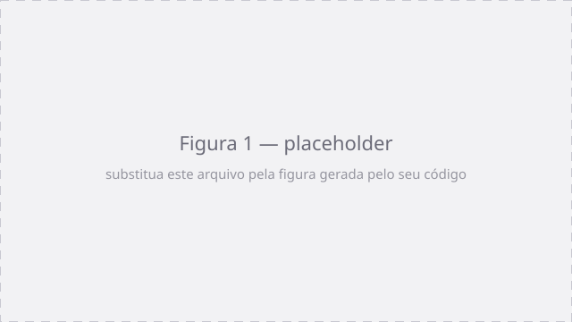

# 2. Perceptron

!!! abstract "Enunciado"

    [Exercises → Perceptron](https://insper.github.io/ann-dl/2026.2/exercises/perceptron/){:target='_blank'} · prazo **22.set.2026**

!!! tip "Como preencher"

    Espelhe a estrutura do enunciado (`## Exercise N` → `### A`, `### B`, ...), coloque os
    scripts em `code/` e as imagens em `figures/`. O exercício
    [1. Data](../data/index.md) traz o modelo completo, com inclusão de código via `--8<--`,
    figura legendada e tabela de resultados.

## Exercise 1

### Abordagem

### Código

### Figuras

/// caption
**Figura 1** — legenda descrevendo o que a figura mostra.
///

### Análise

## Exercise 2

### Abordagem

### Código

### Figuras

### Análise

## Exercise 3

### Abordagem

### Código

### Figuras

### Análise

## Results summary

| # | Métrica | Valor |
|---|---------|-------|
| 1 | | |
| 2 | | |
| 3 | | |

## Discussão

## Conclusão
