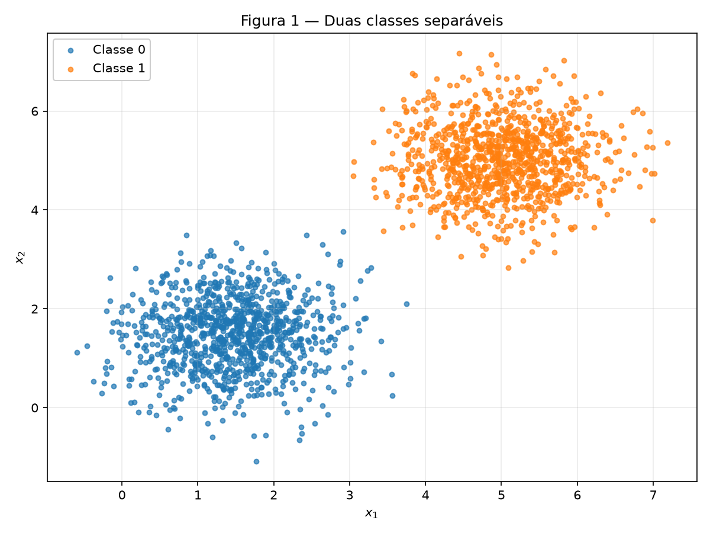
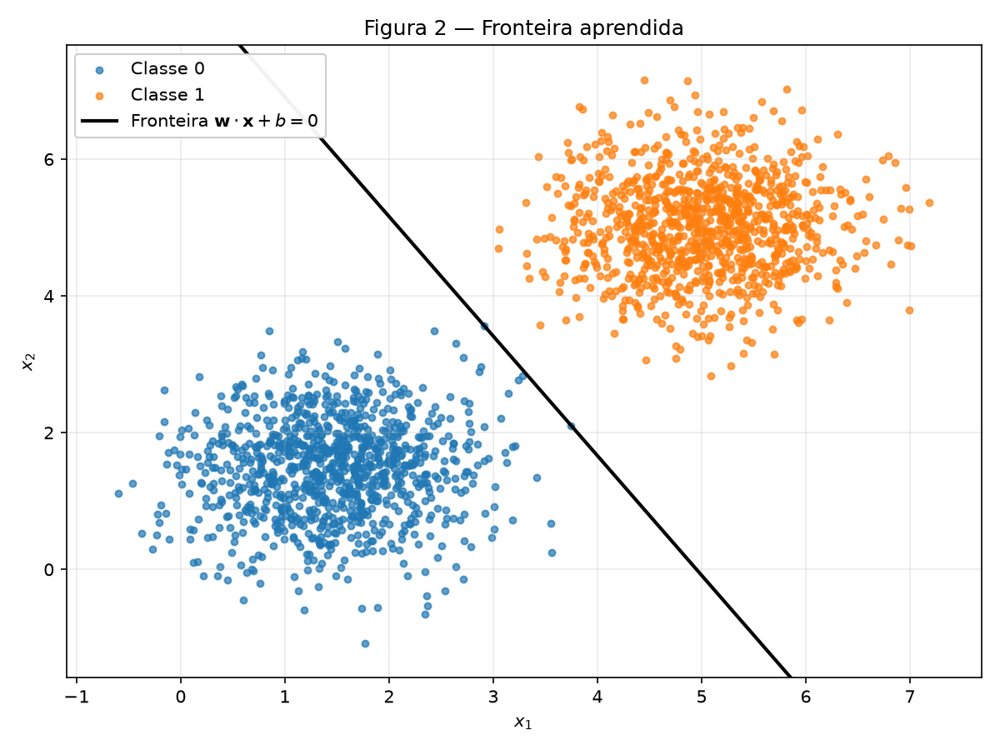
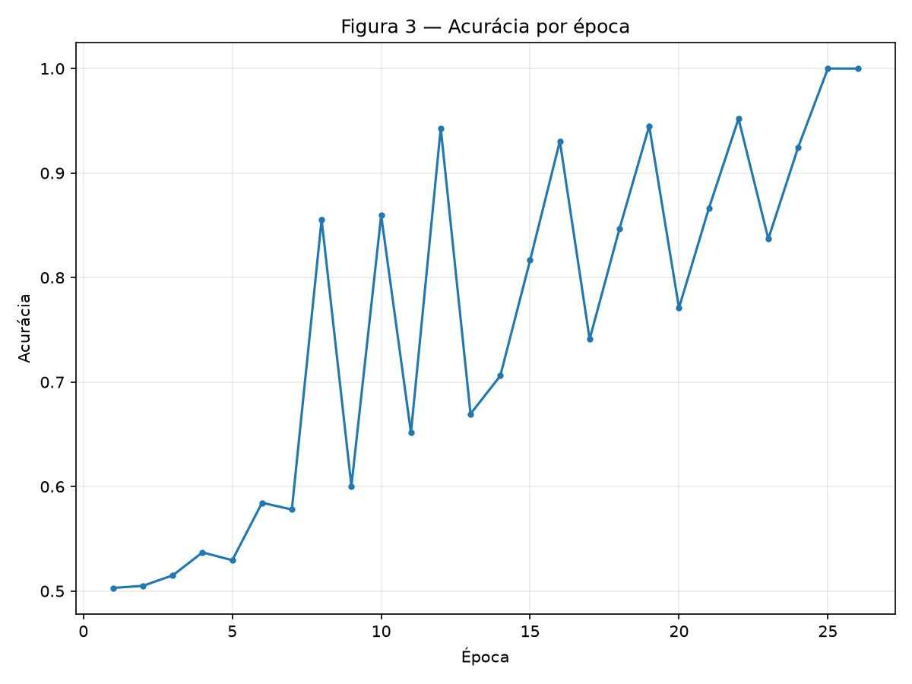
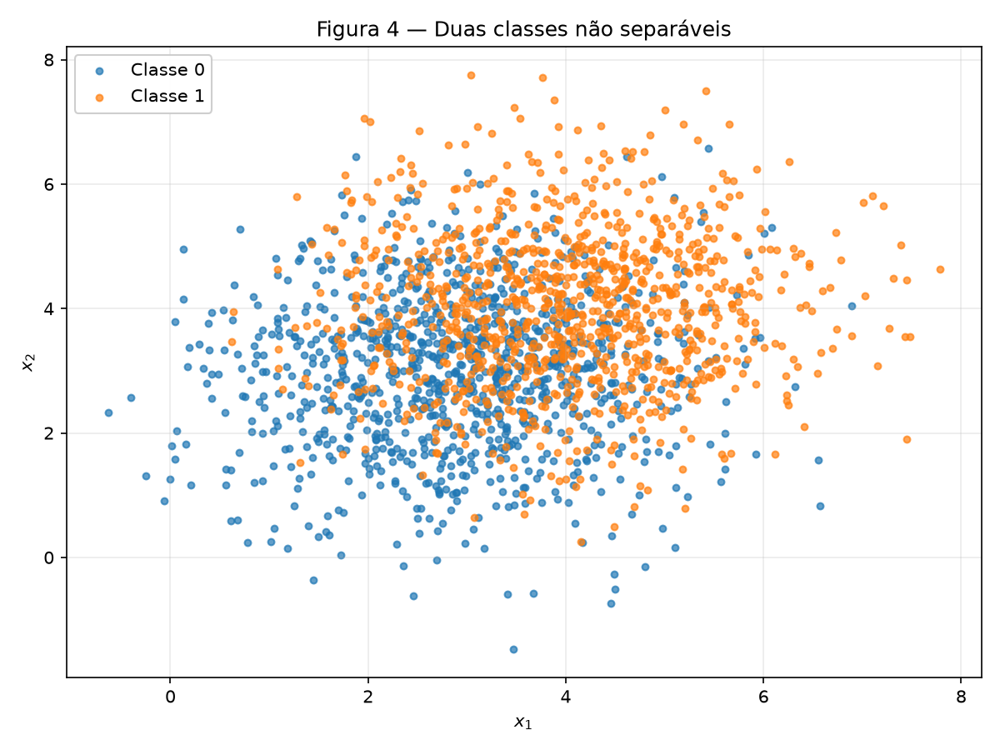
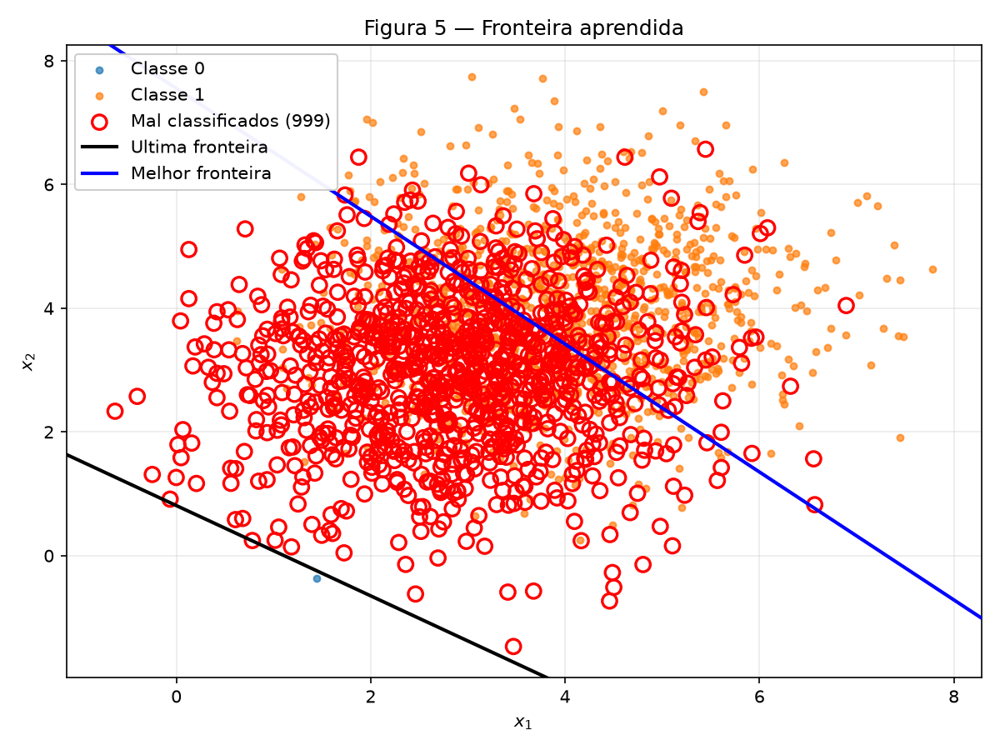
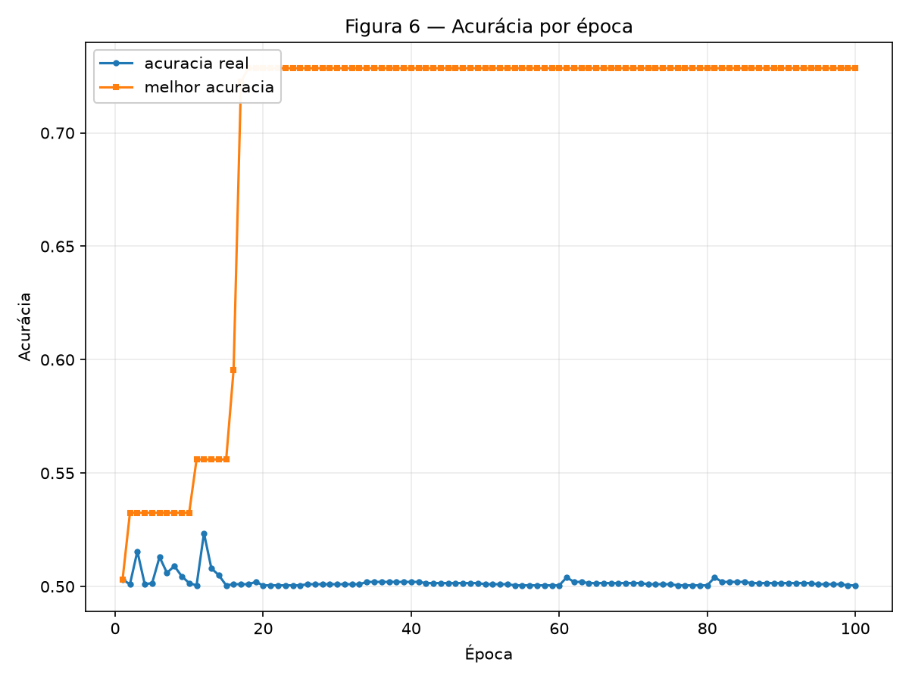

# 2. Perceptron

!!! abstract "Enunciado"

    [Exercises → Perceptron](https://insper.github.io/ann-dl/2026.2/exercises/perceptron/){:target='_blank'} · prazo **22.set.2026**

    Os dois exercícios usam o **mesmo perceptron**, sem alteração nenhuma. O que muda é só a
    geometria dos dados: no Exercício 1 as classes são separáveis por uma reta, no Exercício 2
    não são. O contraste entre os dois resultados é o assunto da entrega.

!!! note "Reprodutibilidade"

    Semente única nos dois scripts: `rng = np.random.default_rng(42)`. Os dados são gerados uma
    vez no `main()` e reusados nas figuras e nas contas, de modo que os números citados abaixo
    saem exatamente da amostra desenhada nas figuras.

## Exercise 1

### Separable Data:

#### Abordagem

Duas gaussianas com centros a 4,95 unidades de distância e desvio 0,71 por eixo — folga de quase
sete desvios entre elas. O perceptron é escrito do zero: `predict` aplica o degrau sobre
$w^\top x + b$, `update` aplica $w \leftarrow w + \eta(y - \hat y)x$ com rótulos $\{0, 1\}$, e o
treino para quando uma passada inteira não produz nenhuma atualização.

#### Código

``` { .python .copy .select linenums='1' title="docs/exercises/perceptron/code/exercise1_separable_data.py" }
--8<-- "docs/exercises/perceptron/code/exercise1_separable_data.py"
```

1.  Semente fixa: sem ela os números da tabela de resultados mudam a cada execução.
2.  `plt.close(fig)` evita o vazamento de figuras quando o script gera várias em sequência.

#### A — Gerar os dados

| Classe | Média $\mu_k$ | Covariância $\Sigma_k$ | Desvio por eixo |
|---|---|---|---:|
| 0 | $[1.5,\ 1.5]$ | $[[0.5,\ 0],\ [0,\ 0.5]]$ | 0.707 |
| 1 | $[5.0,\ 5.0]$ | $[[0.5,\ 0],\ [0,\ 0.5]]$ | 0.707 |


/// caption
**Figura 1** — 2000 pontos, 1000 por classe. Há um corredor vazio entre as nuvens.
///

A amostra reproduz os parâmetros pedidos: médias $[1{,}450;\ 1{,}473]$ e $[5{,}010;\ 5{,}013]$,
desvios entre 0,701 e 0,716.

#### B — Implementar o perceptron

`predict` devolve 1 se $w^\top x + b \ge 0$ e 0 caso contrário. `update` usa $(y - \hat y)$, e não
$y$ — com rótulos $\{0, 1\}$ a forma $w \leftarrow w + \eta y x$ nunca corrigiria um falso
positivo, porque não atualizaria nada na classe 0.

O critério de parada não usa função de perda. A atualização acontece **se e somente se**
$y \neq \hat y$, logo uma passada sem nenhuma atualização é o mesmo que uma passada sem nenhum
erro. Contar atualizações já é a medida de convergência, e é exata.

Inicialização: $w \sim \mathcal{N}(0;\ 0{,}01)$, $b = 0$, $\eta = 0{,}01$, teto de 100 épocas.

#### C — Treinar e medir

| | Valor |
|---|---|
| $w$ final | $[0{,}0505;\ 0{,}0289]$ |
| $b$ final | $-0{,}2500$ |
| Épocas até convergir | **26** (de 100 permitidas) |
| Acurácia final | **100,00 %** |
| Pontos mal classificados | 0 de 2000 |


/// caption
**Figura 2** — Fronteira $w \cdot x + b = 0$ sobre os dados. Não há pontos marcados em vermelho
porque a acurácia é 100 % — nenhum ponto foi mal classificado.
///


/// caption
**Figura 3** — Acurácia por época. A curva oscila entre 50 % e 95 % antes de fixar em 100 % na
época 25.
///

#### D — Análise

A covergência do modelo ser rápida se da pelo fato de que há uma margem grande onde a linha podia ser traçada, assim a quantidade de erros, pelo proprio teorema da convergência dos perceptrons, será finita e baixa, devido hágrande margem.
Com o learning step aumentado para 1, o modelo demorou 37 epocas para convergir, além de que a direção de w é a mesma que o original, junto com a acurácia. Esse termo basicamente controla qual é o tamanho do salto de que será atualizado os parametros. Quando ele é muito grande, como esse caso, por exemplo, ele acaba tendendo a achar valores maiores, o que fez ele achar outro caminho possível para o mesmo problema e demorar mais do que o original, com ele sendo igual a 0.01.
Usando as formulas matematicas de atualização dos parâmetros, vemos que começar com w e b setados para 0 não é uma boa decisão pois as previsões dos dois sempre serão inicialmente iguais, e, realizando os passos seguintes sem b e w iniciais, vemos que o modelo passará a ignorar o learning rate, apesar de ainda achar a mesma fronteira no mesmo numero de épocas que originalmente acharia.

## Exercise 2

### Overlapping Data:

#### Abordagem

Mesmo perceptron, sem uma linha alterada. Os centros agora distam 1,41 unidades e o desvio subiu
para 1,22 por eixo, então as nuvens se sobrepõem e nenhuma reta as separa. Como o laço nunca
para de atualizar, o treino guarda **dois** conjuntos de pesos: o iterado final e o *pocket* — o
melhor já visto, copiado a cada atualização que melhora a acurácia sobre o conjunto inteiro.

#### Código

``` { .python .copy .select linenums='1' title="docs/exercises/perceptron/code/exercise2_non_separable_data.py" }
--8<-- "docs/exercises/perceptron/code/exercise2_non_separable_data.py"
```

#### A — Gerar os dados

| Classe | Média $\mu_k$ | Covariância $\Sigma_k$ | Desvio por eixo |
|---|---|---|---:|
| 0 | $[3{,}0,\ 3{,}0]$ | $[[1{,}5,\ 0],\ [0,\ 1{,}5]]$ | 1,225 |
| 1 | $[4{,}0,\ 4{,}0]$ | $[[1{,}5,\ 0],\ [0,\ 1{,}5]]$ | 1,225 |


/// caption
**Figura 4** — 2000 pontos, 1000 por classe. Os centros estão a 1,41 unidades um do outro
enquanto cada nuvem tem desvio 1,22 — a sobreposição domina a figura.
///

#### B — Treinar guardando os melhores pesos

O laço rodou as 100 épocas inteiras, com 382 atualizações no total: `atualizacoes == 0` nunca
acontece, porque sempre existe algum ponto do lado errado de qualquer reta.

| | $w$ | $b$ | Acurácia | Erros |
|---|---|---|---:|---:|
| **Iterado final** | $[0{,}0361;\ 0{,}0494]$ | $-0{,}0400$ | **50,05 %** | 999 |
| **Pocket** | $[0{,}0068;\ 0{,}0066]$ | $-0{,}0500$ | **72,85 %** | 543 |

Os 999 erros do iterado final são **todos da classe 0**: a última atualização deixou a reta tão
baixa que quase toda a nuvem azul caiu do lado "1". Os 543 erros do pocket se dividem entre as
duas classes (362 da classe 1, 181 da classe 0), que é o esperado de uma fronteira sensata sobre
dados sobrepostos.

#### C — Figuras


/// caption
**Figura 5** — As duas fronteiras sobre os mesmos dados. Os círculos vermelhos são os 999 pontos
que o **iterado final** (preta) erra; a fronteira do pocket (azul) atravessa o meio da
sobreposição.
///


/// caption
**Figura 6** — Acurácia por época. A curva azul é o iterado final, presa em torno de 50 % pelas
100 épocas; a laranja é o melhor valor já visto, que sobe em degraus e trava em 72,85 % na
época 18.
///

#### D — Análise

Na imagem 5, vemos uma grande diferença na melhor reta da reta final pois ao tentar achar a reta ideal, o modelo acaba mudando muito mais o w do que o b, o que faz com que em algum momento o modelo ficasse preso perto da origem do gráfico e como a distância da reta para sua origem é |b|/|w|, com w aumentando 5 vezes mais do que b, esse numero fica em um ciclo de oscilação em volta da origem.
O teorema de convergencia de perceptrons afirma que para um problema com dados linearmente separáveis, um perceptron consiguirá achar uma fornteira de decisão que os separe com 100% acurácia. Porém, no segundo caso, o nosso problema não é linearmente separável, o que faz com que o gráfico de acurácia não converja.
No segundo caso, nem alterar o learning rate e nem aumentar o limite de épocas ajudará o modelo a convergir melhor, já que o nosso problema maior é o fato de que nesse caso, não há, praticamente, nenhuma linha que passe de 73% de acurácia. Se aumentarmos o learning rate ou diminuilos não ajudará a mudar a distância da reta até sua origem e aumentar épocas também não ajuda, já que a proporção de atualização entre w e b continuara a mesma, aproximadamente |x|.

## Results summary

| # | Quantidade | Valor |
|---|------------|-------|
| 1 | Exercício 1 — $w$ e $b$ finais | $w = [0{,}0505;\ 0{,}0289]$ · $b = -0{,}2500$ |
| 2 | Exercício 1 — épocas até convergir | **26** (de 100 permitidas) |
| 3 | Exercício 1 — acurácia final | **100,00 %** (0 erros em 2000) |
| 4 | Exercício 1 — épocas e acurácia final com $\eta = 1{,}0$ | **37 épocas** · **100,00 %** |
| 5 | Exercício 2 — $w$ e $b$ finais | $w = [0{,}0361;\ 0{,}0494]$ · $b = -0{,}0400$ |
| 6 | Exercício 2 — acurácia dos pesos finais | **50,05 %** (999 erros em 2000) |
| 7 | Exercício 2 — acurácia dos pesos do pocket | **72,85 %** (543 erros em 2000) |
| 8 | Exercício 2 — época em que o melhor pocket ocorreu | **18** (de 100) |
