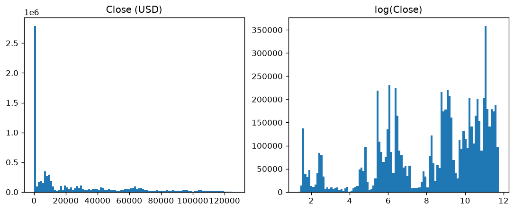
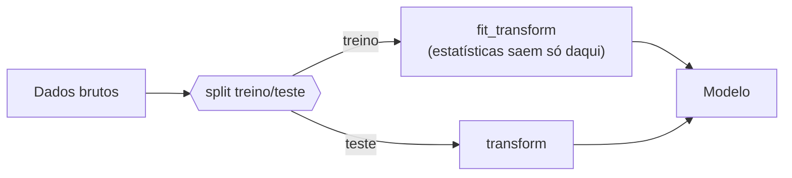
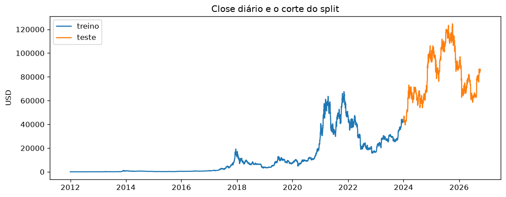

# 1. EDA — Análise Exploratória

!!! abstract "Entrega 1 de 3 do [Projeto](../index.md)"

    [Projects → EDA](https://insper.github.io/ann-dl/2026.2/projects/eda/){:target='_blank'} · prazo **08.out.2026**

!!! info "Equipe"

    | Nome completo | GitHub |
    |---------------|--------|
    |Theo França |TheoRibeiroFranca |
    | | |
    | | |

    Dataset, decisões e status: [página do projeto](../index.md).

!!! tip "O que esta entrega decide"

    O EDA não é um álbum de gráficos: é onde a equipe **escolhe o dataset** e descobre o que
    vai atrapalhar o treino depois — desbalanceamento, vazamento, escalas incompatíveis com a
    ativação, ausências não aleatórias. Cada achado aqui deve virar uma linha do plano de
    pré-processamento no fim da página, e é esse plano que as duas entregas
    seguintes executam.

    As aulas de **Classes → Data** no
    [site da disciplina](https://insper.github.io/ann-dl/){:target='_blank'} dão a estrutura:
    tipos, distribuições, qualidade, desbalanceamento, vazamento, split e pré-processamento.

## 1. Dataset

| | |
|---|---|
| **Nome** | Bitcoin Historical Data (`btcusd_1-min_data.csv`) |
| **Fonte** | [Kaggle — mczielinski/bitcoin-historical-data](https://www.kaggle.com/datasets/mczielinski/bitcoin-historical-data){:target='_blank'}, dados da exchange **Bitstamp** |
| **Licença** | [CC BY-SA 4.0](https://creativecommons.org/licenses/by-sa/4.0/){:target='_blank'} |
| **Versão** | 745 (393,95 MB) |
| **Período** | 2012-01-01 00:01 → 2026-10-06 03:43 (UTC) |
| **Dimensões** | 7 764 703 linhas × 6 colunas |
| **Tarefa** | Regressão — prever o preço de fechamento (`Close`) |

**O que é cada linha:** uma janela de **1 minuto** de negociação do par BTC/USD na Bitstamp,
no formato OHLCV (*Open, High, Low, Close, Volume*). A série é contínua: a diferença entre
timestamps consecutivos é sempre de 60 s, sem buracos nem timestamps repetidos — minutos sem
negócio aparecem com `Volume = 0` e o preço repetido do minuto anterior (16,9% das linhas).

**Por que este dataset:** é uma série temporal longa (quase 15 anos), limpa e de domínio
público, com milhões de amostras — volume suficiente para treinar uma rede neural — e um alvo
contínuo natural para regressão. Também cobre regimes muito diferentes de preço (de US$ 3,80
a US$ 126 mil), o que torna o pré-processamento (escala, retornos, split temporal) uma parte
real do problema.

## 2. Estrutura e tipos

7 764 703 amostras, 1 coluna de tempo, 4 features numéricas e 1 alvo. No arquivo bruto, o
pandas lê `Timestamp` como `int64` e o resto como `float64`; o `Timestamp` está com o tipo
errado — é um instante em *Unix time* (segundos desde 1970-01-01 UTC), não uma quantidade —
e é convertido com `pd.to_datetime(..., unit="s")` e usado como índice da série.

| Feature | Tipo | Unidade | Significado | Cardinalidade / faixa | Observação |
|---------|------|---------|-------------|-----------------------|------------|
| `Timestamp` | data/hora (lida como `int64`) | s (Unix, UTC) | Início da janela de 60 s | 7 764 703 valores únicos; 2012-01-01 → 2026-10-06 | Identificador da linha → vira índice, não feature |
| `Open` | numérica contínua | USD | Preço da primeira negociação da janela | 3,80 – 126 202 | — |
| `High` | numérica contínua | USD | Maior preço negociado na janela | 3,80 – 126 272 | — |
| `Low` | numérica contínua | USD | Menor preço negociado na janela | 3,80 – 126 158 | — |
| `Close` | numérica contínua | USD | Preço da última negociação da janela | 3,80 – 126 202 | **Alvo** |
| `Volume` | numérica contínua | BTC | Quantidade de bitcoin negociada na janela | 0 – 5 853,85 | 16,9% de zeros (minutos sem negócio) |

Nenhuma coluna tem valores ausentes e não há linhas duplicadas (detalhes na seção 6).

!!! warning "Atenção para a parte B"

    `Open`, `High` e `Low` são do **mesmo minuto** que o `Close`: usá-los para prever o
    `Close` daquele minuto é vazamento (`Low ≤ Close ≤ High` por construção). O alvo terá de
    ser o `Close` de um instante **futuro**, usando só informação passada.

## 3. Variável alvo

O alvo é o preço de fechamento `Close` (regressão).

| Série | Média | Desvio | Mín | Q1 | Mediana | Q3 | Máx | Assimetria |
|-------|-------|--------|-----|----|---------|----|-----|------------|
| `Close` (USD) | 24 335 | 31 708 | 3,80 | 470,40 | 8 255 | 40 903 | 126 202 | 1,32 |

/// caption
**Figura 1** — Histograma do `Close` em USD (esq.) e de `log(Close)` (dir.).
///

- **Preço bruto:** assimetria positiva forte (1,32), com média três vezes maior que a mediana.
  Um terço dos minutos tem preço abaixo de US$ 1 000, porque o bitcoin passou anos barato.
  Por isso aparece o pico perto de zero na Figura 1. A distribuição não tem "forma": é o
  histórico de quanto tempo o preço passou em cada patamar.
- **log(Close):** comprime as 4,5 ordens de grandeza (US$ 3,80 → US$ 126 mil) e remove a
  assimetria positiva, mas continua com vários picos, um por regime de mercado.
- Não há zeros nem censura: o preço não tem teto nem piso artificiais.

!!! question "Responda"

    Não há classes, então não há desbalanceamento.

## 4. Análise univariada

Distribuição de cada feature relevante: medidas de posição e dispersão, e o formato.
Não gere 40 histogramas; escolha os que mudam alguma decisão e explique o critério.

## 5. Análise bivariada e correlações

Relação entre as features e o alvo, e entre as features.

!!! danger "Correlação alta demais com o alvo é suspeita"

    Uma feature que prevê o alvo quase perfeitamente costuma ser **vazamento**: informação
    que só existe depois do fato que você quer prever. Investigue antes de comemorar.

## 6. Qualidade dos dados

### Valores ausentes

| Feature | % ausente | Padrão (aleatório?) | Tratamento planejado |
|---------|-----------|---------------------|----------------------|
| todas | 0% | — | nenhum |

Nenhuma célula é `NaN`. A ausência existe, mas aparece de outra forma: um minuto sem
negócio vem com `Volume = 0` e com `Open = High = Low = Close` igual ao último preço
(1 312 416 linhas, 16,9%, e em **todas** elas os quatro preços são iguais). Ou seja, o
preço desses minutos é preenchido, não observado.

### Duplicatas e inconsistências

| Verificação | Linhas |
|-------------|--------|
| Linhas duplicadas (incluindo o `Timestamp`) | 0 |
| Timestamps repetidos | 0 |
| Intervalo entre linhas ≠ 60 s (buracos na série) | 0 |
| Preço ≤ 0 | 0 |
| `Volume` < 0 | 0 |
| `High` < `Low` | 0 |
| `Open` fora de [`Low`, `High`] | 0 |
| `Close` fora de [`Low`, `High`] | 0 |

O arquivo é internamente consistente: todas as regras de um candle OHLC valem em todas as
linhas.

**Colunas a remover:**

- `Timestamp`: identificador da linha. Vira índice da série, não feature.
- **Constantes:** nenhuma (todas as colunas têm mais de um valor único).
- **Vazam o alvo:** `Open`, `High` e `Low` do **mesmo minuto** do `Close` (correlação de
  Pearson = 1,000000 com o alvo) — ver seção 7.

### Outliers

Como foram detectados e o que será feito com eles — e por quê. Remover outlier é decisão de
modelagem, não faxina.

## 7. Riscos de vazamento

Liste as fontes de vazamento identificadas e como cada uma será contida.

| Risco | Onde aparece | Contenção |
|-------|--------------|-----------|
| Estatísticas calculadas antes do split | Média/desvio do `StandardScaler` | Ajustar transformadores só no treino |
| OHLC do mesmo minuto do alvo | `Open`, `High`, `Low` no minuto *t* para prever `Close[t]` (`Low ≤ Close ≤ High` por construção; correlação = 1,0) | Alvo é o `Close` de um instante **futuro**; features só com informação até *t* |
| Split aleatório numa série temporal | Minutos vizinhos (quase idênticos) em treino e teste | Split **temporal** (seção 9) |
| Janelas que atravessam o corte | Features com *lags*/médias móveis no início do teste usando dados do treino, ou alvo do fim do treino olhando para o teste | Gerar janelas depois do split, ou descartar as linhas na borda |

## 8. Plano de pré-processamento

A saída desta entrega. Uma linha por transformação, ligando cada uma a um achado acima.

| # | Transformação | Features | Motivo (seção) |
|---|---------------|----------|----------------|
| 1 | | | |

## 9. Estratégia de split

Split **temporal** com corte fixo em **2024-01-01**: tudo antes vai para o treino, tudo
depois para o teste. Não há aleatoriedade, então a semente (`SEED = 42`) não muda o resultado,
e não há estratificação porque o alvo é contínuo. O corte no tempo é o que impede o modelo
de "ver o futuro". Num split aleatório, o minuto *t* ficaria no teste e o *t−1*, quase
idêntico, no treino.

| Conjunto | Linhas | % | Período | `Close` mín – máx (USD) | `Close` médio (USD) |
|----------|--------|---|---------|-------------------------|---------------------|
| Treino | 6 311 519 | 81,3% | 2012-01-01 00:01 → 2023-12-31 23:59 | 3,80 – 69 000 | 11 319 |
| Teste | 1 453 184 | 18,7% | 2024-01-01 00:00 → 2026-10-06 03:43 | 38 508 – 126 202 | 80 868 |

/// caption
**Figura 2** — `Close` diário (último minuto de cada dia), com o treino em azul e o teste em
laranja. A troca de cor marca o corte de 2024-01-01.
///

!!! danger "O teste está fora da faixa do treino"

    **61,4%** dos minutos do teste têm `Close` acima do máximo do treino (US$ 69 000): o
    modelo seria avaliado num território que nunca viu. Isso pesa contra usar o preço bruto
    como alvo ou como entrada. Retornos ou preço normalizado por janela não sofrem com isso.

**A partir daqui, toda estatística de pré-processamento (média, desvio)
é calculada só no conjunto de treino** e aplicada ao teste com `transform`.
Se for preciso um conjunto de validação, ele sai do fim do treino, também por corte
temporal.

## Results summary

| # | Métrica | Valor |
|---|---------|-------|
| 1 | Amostras | 7 764 703 |
| 2 | Features (antes / depois do encoding) | |
| 3 | Features com ausentes | 0 (`NaN`); 16,9% dos minutos sem negócio |
| 4 | Maior % de ausência em uma feature | 0% |
| 5 | Linhas duplicadas | 0 |
| 6 | Razão de desbalanceamento do alvo | não se aplica (regressão) |
| 7 | Acurácia (ou erro) do baseline trivial | |
| 8 | Maior correlação feature–alvo | 1,000 (`Open`/`High`/`Low` do mesmo minuto — vazamento) |
| 9 | Amostras treino / teste após o split | 6 311 519 / 1 453 184 |

## Conclusão

O que o dataset permite e o que ele impede. Se algum achado inviabiliza a tarefa pretendida,
é aqui que a equipe muda de rumo — ainda dá tempo.

## Referências
